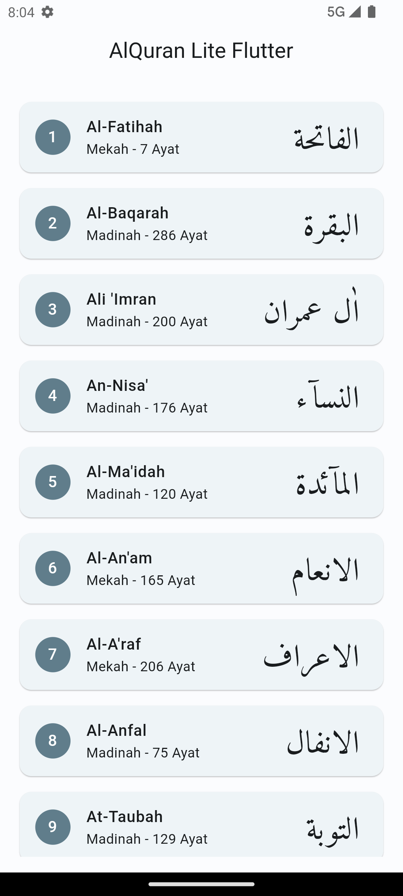
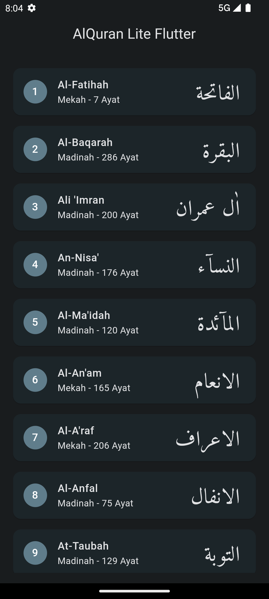
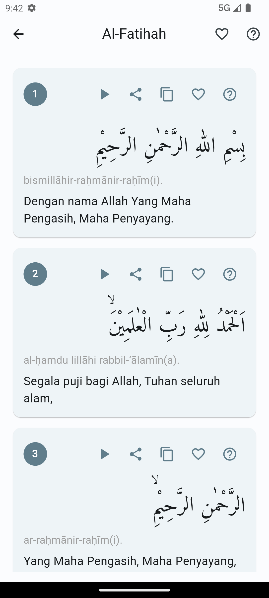
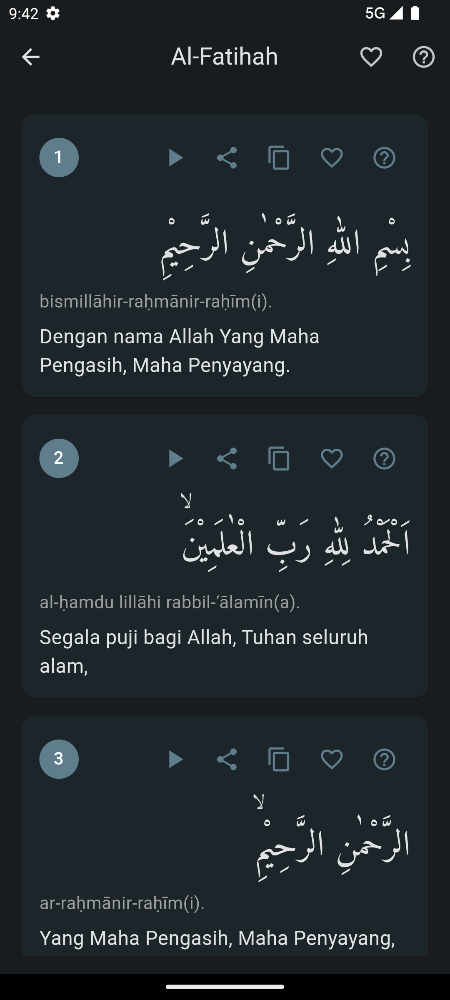
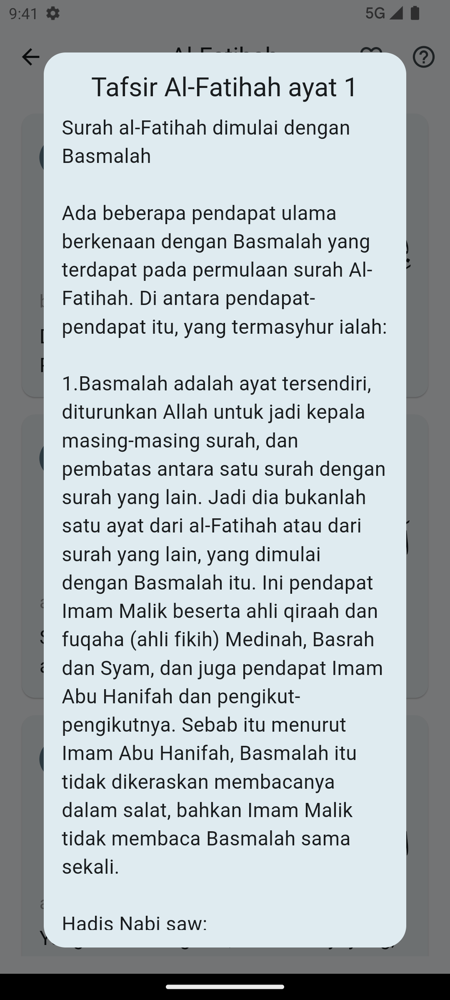
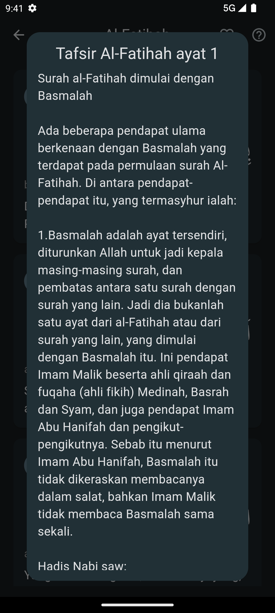

# Al-Quran Lite Flutter

Aplikasi Al-Quran Lite ini dibuat menggunakan Flutter. Aplikasi ini menggunakan API dari [https://equran.id/apidev/](https://equran.id/apidev/).

## Fitur
    [x] Daftar Surah
    [x] Daftar Ayat
    [x] Tafsir
    [ ] Bookmark
    [ ] Riwayat baca
    [ ] Terakhir di baca
    [ ] Pencarian
    [ ] Audio
    [ ] Tajwid berwarna
    [ ] Asmaul Husna
    [ ] Jadwal sholat
    [ ] Doa harian
    [ ] Arah qiblat
    [ ] Habit tracker

## Screenshot

<!-- create 2 x 3 table with header Light Mode and Dark Mode -->
| Light Mode | Dark Mode |
|------------|-----------|
|||
|||
|||

## Cara Install
- Clone repository ini
```
git clone https://github.com/dariyanto/alquran_lite_flutter
```

- Masuk ke folder project
```
cd alquran_lite_flutter
```

- Jalankan perintah berikut untuk menginstall semua package yang dibutuhkan
```
flutter pub get
```

- Jalankan perintah berikut untuk menjalankan aplikasi
```
flutter run
```

## Kontribusi

Jika ingin berkontribusi pada project ini, silahkan fork repository ini, lakukan perubahan, lalu buat pull request.

## Lisensi

Project ini menggunakan lisensi [MIT](LICENSE).

## Feedback
Jika ada pertanyaan atau saran, silahkan buat issue baru atau hubungi saya melalui [redcircleapps@gmail.com](mailto:redcircleapps@gmail.com).

## Donasi
Jika ingin berdonasi, bisa melalui link berikut:

<a href="https://www.buymeacoffee.com/dariyan0078"></a>

<a href="https://trakteer.id/dariyanto%20rame/tip">
</a>

[https://trakteer.id/dariyanto%20rame/tip](https://trakteer.id/dariyanto%20rame/tip)